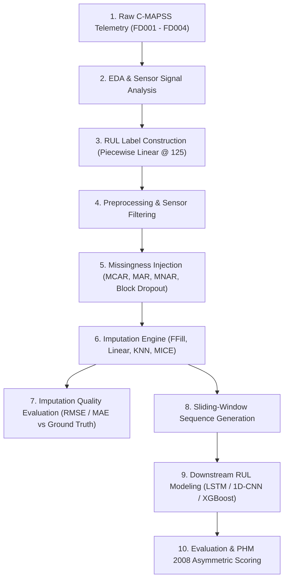

# 🚀 End-to-End Roadmap: Missingness Experiment, Imputation & RUL Modeling on C-MAPSS

This document outlines the end-to-end experimental roadmap for the **NASA Turbofan Engine Degradation Simulation Dataset (C-MAPSS)**, focusing on **sensor missingness injection, multivariate time-series imputation benchmarking**, and measuring the **downstream impact on Remaining Useful Life (RUL) prediction**.

---

## 🗺️ High-Level Architecture & Workflow

---

## 📑 Detailed Stage-by-Stage Breakdown

### 1. Exploratory Data Analysis (EDA) & Signal Understanding
* **Focus Sub-dataset**: Start with `FD001` (Single Sea-Level Operating Condition, Single HPC Fault Mode: 100 train / 100 test engines).
* **Trajectory Visualization**: Plot full run-to-failure cycles for selected engine units (e.g., Units #1, #24, #70) across key degradation sensors.
* **Identify Near-Constant Sensors in FD001**:
  * Near-zero variance / invariant sensors: `s_1`, `s_5`, `s_6`, `s_10`, `s_16`, `s_18`, `s_19`.
  * Active degradation sensors: `s_2`, `s_3`, `s_4`, `s_7`, `s_8`, `s_9`, `s_11`, `s_12`, `s_13`, `s_14`, `s_15`, `s_17`, `s_20`, `s_21`.
* **Cross-Sensor Physical Coupling**: Pearson & Spearman correlation heatmaps (e.g., $T_{30}$ High-Pressure Compressor outlet temperature, $T_{50}$ Low-Pressure Turbine outlet temperature, and $P_{30}$ total pressure).

---

### 2. RUL Label Construction
* **Run-to-Failure Calculation (Training Set)**:
  $$\text{RUL}(u, t) = T_{\text{max}}^{(u)} - t$$
  where $T_{\text{max}}^{(u)}$ is the last operational cycle before failure for engine unit $u$, and $t$ is the current cycle.
* **Piecewise-Linear RUL Target (Early-Life Clipping)**:
  In early cycles, engine wear is negligible and sensors exhibit normal operating baseline. Predicting exact high RUL early on introduces noise. Cap the target at $RUL_{\text{early}} = 125$:
  $$\text{RUL}_{\text{clipped}}(u, t) = \min\left(RUL_{\text{early}},\, T_{\text{max}}^{(u)} - t\right)$$
* **Test Set Ground Truth**:
  Test trajectories end abruptly prior to failure. Ground truth RUL values are given in `RUL_FD001.txt` for the last observed cycle $T_{\text{end}}^{(u)}$ of each test engine:
  $$\text{RUL}_{\text{test}}(u, t) = \text{RUL}_{\text{true}}^{(u)} + (T_{\text{end}}^{(u)} - t)$$

---

### 3. Preprocessing & Normalization
* **Drop Near-Constant Sensors**: Filter out sensors with standard deviation $\sigma \approx 0$.
* **Standardization (Z-Score / MinMax)**:
  $$z = \frac{x - \mu_{\text{train}}}{\sigma_{\text{train}}}$$
  *(Fit scalers strictly on training trajectories; transform test sets to avoid data leakage).*
* **Multi-Condition Normalization (For FD002 & FD004)**:
  In multi-regime datasets with 6 flight conditions, cluster operating settings (`setting_1`, `setting_2`, `setting_3`) into 6 regimes via KMeans, and apply regime-conditioned normalization:
  $$z^{(k)} = \frac{x - \mu_{\text{train}}^{(k)}}{\sigma_{\text{train}}^{(k)}} \quad \text{for regime } k \in \{1, \dots, 6\}$$

---

### 4. Missingness Experiment Design (Benchmarking Framework)

Simulate realistic industrial telemetry faults on clean data by masking a controlled fraction of sensor readings while retaining the exact ground truth:

| Missingness Mechanism | Physical Real-World Analogy | Implementation Logic |
| :--- | :--- | :--- |
| **MCAR** (Missing Completely at Random) | Sporadic packet loss / wireless noise | Independent uniform random masking across all active sensors. |
| **MAR** (Missing at Random) | Sensor drops conditioned on extreme flight regimes | Drop probability conditioned on high throttle/altitude (`setting_1`, `setting_2`). |
| **MNAR** (Missing Not at Random) | Sensor degradation / thermal overload near end-of-life | Higher probability of missingness as the engine approaches failure ($t \to T_{\text{max}}$). |
| **Block / Burst Dropout** | Telemetry transmitter blackout or frozen sensor channel | Contiguous blocks of missing cycles (e.g., length $L \in [5, 20]$ consecutive cycles). |

* **Missingness Rates Tested**: $\eta \in \{0\%, 5\%, 10\%, 20\%, 30\%\}$.

---

### 5. Imputation Engine

Apply multiple tiers of imputation strategies:

1. **Univariate / Simple Baselines**:
   * **Forward-Fill (LOCF)**: Streaming-friendly; carries the last known sensor measurement forward.
   * **Trajectory-Grouped Linear Interpolation**: Interpolates linearly across missing cycles within the same engine unit $u$.
   * **Fleet Median / Mean**: Global feature median.
2. **Multivariate Machine Learning Imputers**:
   * **$K$-Nearest Neighbors ($K\text{-NN}$)**: Imputes missing sensor measurements using the $K$ most correlated sensor states in Euclidean space.
   * **MICE (IterativeImputer)**: Models each sensor with missing values as a function of all other correlated sensors using regularized regressors (Bayesian Ridge or Extra Trees).
3. **Temporal Deep Learning / Sequence-Aware (Optional Advanced)**:
   * **Bidirectional LSTM / Denoising Autoencoder**: Reconstructs complete multivariate time-series windows from corrupted inputs.

---

### 6. Imputation Quality Evaluation (Direct Metric)
Evaluate how accurately each imputer reconstructs the held-out true sensor values across missing rates:

$$\text{RMSE}_{\text{impute}} = \sqrt{\frac{1}{|\mathcal{M}|} \sum_{(i,j) \in \mathcal{M}} \left( X_{\text{true}}(i,j) - \hat{X}_{\text{imputed}}(i,j) \right)^2}$$
$$\text{MAE}_{\text{impute}} = \frac{1}{|\mathcal{M}|} \sum_{(i,j) \in \mathcal{M}} \left| X_{\text{true}}(i,j) - \hat{X}_{\text{imputed}}(i,j) \right|$$
*(where $\mathcal{M}$ is the index set of artificially masked values).*

---

### 7. Downstream RUL Impact Evaluation
Evaluate whether superior imputation directly translates into better downstream prognostics:
* Train RUL model on clean data $\rightarrow$ establish baseline score.
* Evaluate RUL prediction on test sets corrupted at $5\%, 10\%, 20\%$ missingness under different imputation methods.
* **Goal**: Measure degradation curve ($\Delta \text{RMSE}_{\text{RUL}}$ and $\Delta \text{Score}_{\text{PHM}}$) across imputers.

---

### 8. RUL Modeling & Prognostic Metrics
* **Sliding Window Sequence Extraction**:
  * Window length $W = 30$ cycles.
  * For engine $u$ at cycle $t$, sequence $S_t^{(u)} = [x_{t-W+1}^{(u)}, \dots, x_t^{(u)}] \in \mathbb{R}^{W \times D}$.
* **Model Architectures**:
  * **Sequence Deep Learning**: 2-layer LSTM / Bi-GRU with Dropout + Dense RUL regression head.
  * **Convolutional**: 1D-CNN + Global Average Pooling.
  * **Tabular Baseline**: Lagged rolling window summary statistics (mean, std, min, max, slope) + XGBoost / LightGBM.
* **Prognostics Scoring Function (PHM 2008 Competition Metric)**:
  Let $d_i = \hat{RUL}_i - RUL_i$ be the prediction error for engine $i$:
  $$S = \sum_{i=1}^{N} s_i, \quad s_i = \begin{cases} e^{-\frac{d_i}{13}} - 1 & \text{for } d_i < 0 \quad (\text{Early Prediction - Safer}) \\ e^{\frac{d_i}{10}} - 1 & \text{for } d_i \ge 0 \quad (\text{Late Prediction - Penalized Heavily}) \end{cases}$$

---

## 📊 Summary Comparison Matrix

| Step | Output / Artifact | Success Criteria |
| :--- | :--- | :--- |
| **1. EDA** | Cleaned feature list (14 active sensors) | Near-constant sensors identified and removed |
| **2. Target** | Piecewise RUL column (capped @ 125) | Smooth target transition from normal to degraded |
| **3. Masking** | Masked matrices & ground-truth index sets | Configurable MCAR / MAR / MNAR / Block rates |
| **4. Imputation** | Reconstructed train & test DataFrames | Zero remaining NaNs, trajectory integrity preserved |
| **5. Eval (Direct)** | Imputation RMSE / MAE benchmark table | $K\text{-NN}$ & MICE outperform simple baseline on correlated sensors |
| **6. Downstream** | Test RUL RMSE & PHM Asymmetric Score | Quantified degradation curve vs. missingness % |
